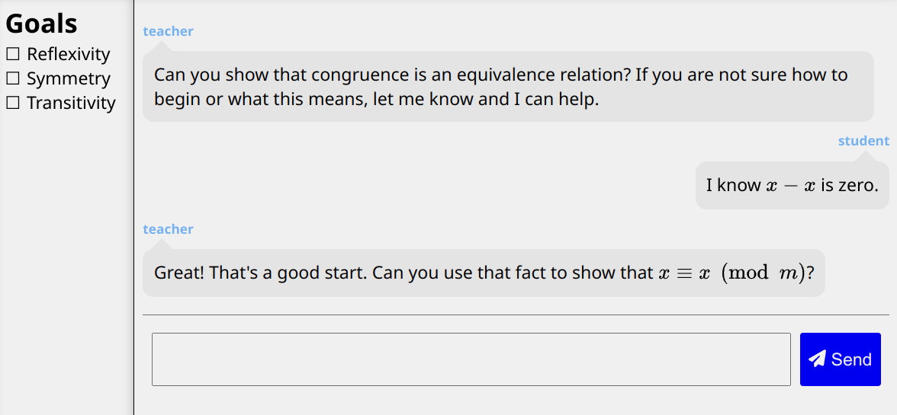

# IBL GPT

This is a chatbot demonstrating the potential of ChatGPT to facilitate [inquiry-based learning or IBL](https://en.wikipedia.org/wiki/Inquiry-based_learning).

A live demo is available at https://iblgpt.xyz/

# How it works

- `src/index.html` provides the single-page UI shell, chat transcript, goals list, and MathJax loader.
- `src/login.js` manages the API key in `localStorage`, validates it against OpenAI, and gates the chat UI.
- `src/chat.js` streams chat completions from OpenAI (`gpt-5.2`) via `fetchEventSource`.
- `src/index.js` orchestrates the chat flow, prompts the teacher persona, and checks proof progress.
- `src/transcript.js` renders chat turns and triggers MathJax typesetting.
- `package.json` scripts build with webpack and deploy the `dist/` folder to GitHub Pages.

# Credits

Thanks to
https://github.com/UcheAzubuko/webpack-boilerplate
for providing webpack boilerplate.
